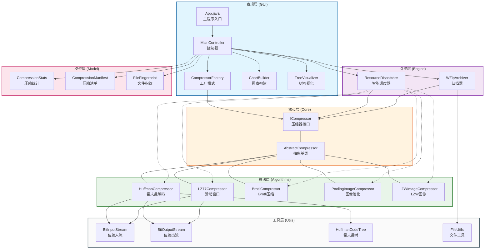
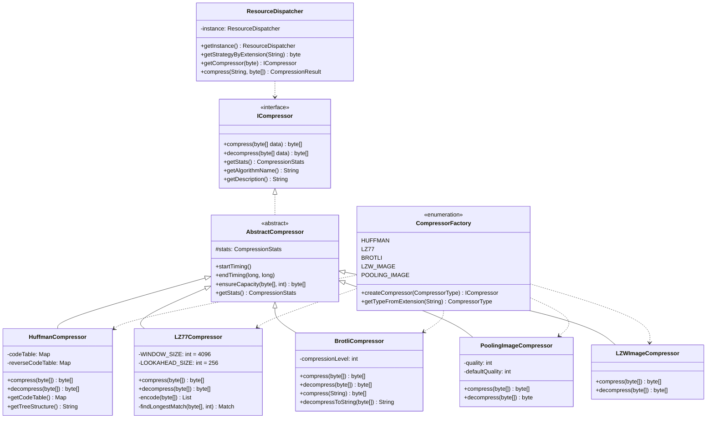
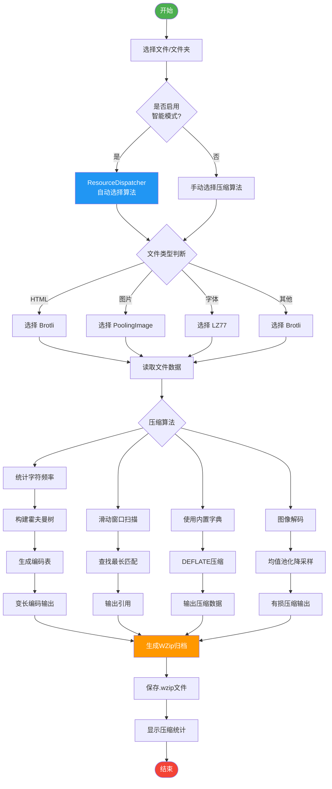
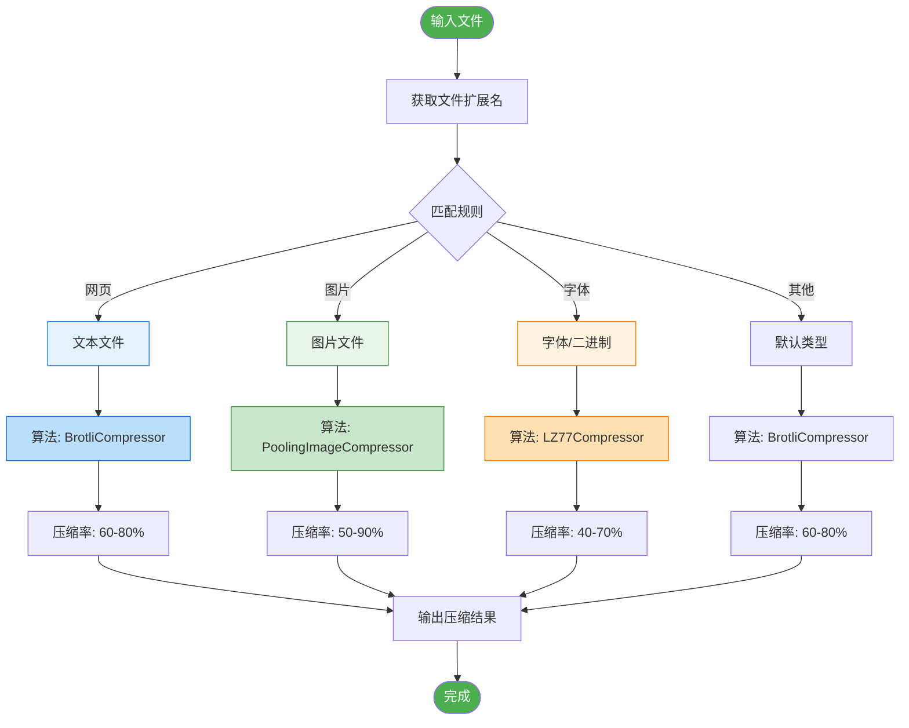
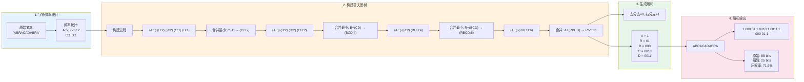
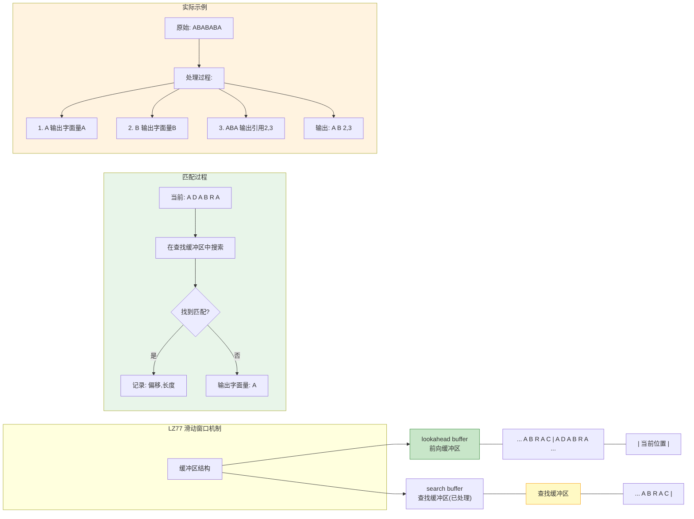
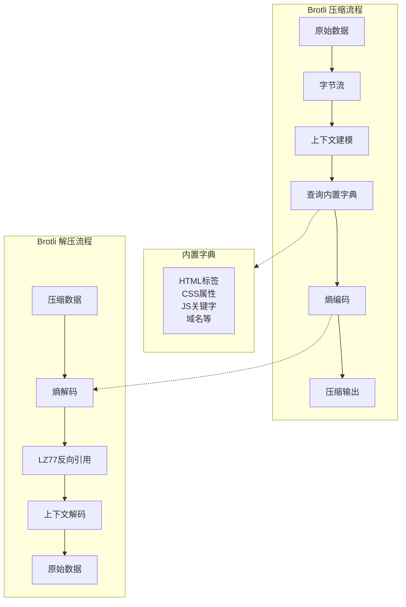

# WebCompressor - 网页资源压缩系统

> 数据结构课程大作业 | JavaFX 17 + Maven

---

## 目录

1. [项目简介](#项目简介)
2. [环境配置](#环境配置)
3. [项目结构](#项目结构)
4. [功能特性](#功能特性)
5. [系统架构](#系统架构)
6. [核心类设计](#核心类设计)
7. [算法原理](#算法原理)
8. [使用说明](#使用说明)

---

## 项目简介

WebCompressor 是一款基于 JavaFX 开发的网页资源压缩系统，支持多种压缩算法，能够对网页文件（HTML、CSS、JS）、图片、字体等资源进行智能压缩，并生成统一的 `.wzip` 归档文件。

### 主要特性

- **多算法支持**：Huffman、LZ77、Brotli、PoolingImage、LZW
- **智能调度**：根据文件类型自动选择最优压缩算法
- **归档功能**：支持将整个网页文件夹压缩为单一 `.wzip` 文件
- **可视化分析**：实时显示压缩率、霍夫曼树结构、传输时间分析
- **跨平台**：基于 Java 17，支持 Windows、macOS、Linux

---

## 环境配置

### 第一步：安装 JDK 17

1. 访问 [Oracle JDK 下载页面](https://www.oracle.com/java/technologies/downloads/#java17) 或 [Adoptium (Eclipse Temurin)](https://adoptium.net/temurin/releases/?version=17)
2. 下载 **Windows x64 Installer** 版本
3. 运行安装程序，完成安装
4. 验证安装：
   ```
   打开命令提示符，输入：
   java -version
   ```
   应显示：`java version "17.0.x"`

### 第二步：安装 JavaFX SDK

1. 访问 [OpenJFX 下载页面](https://gluonhq.com/products/javafx/)
2. 下载 **JavaFX SDK 17** for Windows
   - 选择 `Windows` → `SDK` → 版本 `17.0.2`
3. 解压到本地目录，例如：`D:\javafx-sdk-17`

### 第三步：安装 Maven

1. 访问 [Apache Maven 下载页面](https://maven.apache.org/download.cgi)
2. 下载 `apache-maven-3.9.x-bin.zip`
3. 解压到目录，例如：`D:\apache-maven`
4. 配置环境变量：
   - 右键 `此电脑` → `属性` → `高级系统设置` → `环境变量`
   - 在 `系统变量` 中新建：
     - 变量名：`MAVEN_HOME`
     - 变量值：`D:\apache-maven`
   - 编辑 `Path`，添加：`%MAVEN_HOME%\bin`
5. 验证安装：
   ```
   mvn -version
   ```

### 第四步：运行项目

```bash
# 进入项目目录
cd WebCompressor

# 编译并运行
mvn clean compile javafx:run -Djava.module.path=D:\javafx-sdk-17\lib
```

> **注意**：请将 `D:\javafx-sdk-17` 替换为你实际解压的 JavaFX SDK 路径

---

### 常见问题

**Q: 运行时报错 "JavaFX runtime components are missing"？**

A: 确保已正确下载 JavaFX SDK 并配置了 `--module-path` 参数。

**Q: 如何打包为可执行 JAR？**

```bash
mvn clean package
java -jar --module-path D:\javafx-sdk-17\lib --add-modules javafx.controls,javafx.fxml target/WebCompressor-1.0.0.jar
```

---

## 项目结构

```
WebCompressor/
├── src/
│   ├── main/
│   │   ├── java/compressor/
│   │   │   ├── gui/              # 图形界面层
│   │   │   │   ├── App.java              # 程序入口
│   │   │   │   ├── MainController.java    # 主控制器
│   │   │   │   ├── CompressorFactory.java # 工厂模式
│   │   │   │   ├── CompressionService.java# 压缩服务
│   │   │   │   ├── ChartBuilder.java      # 图表构建
│   │   │   │   └── TreeVisualizer.java    # 树可视化
│   │   │   │
│   │   │   ├── core/             # 核心接口层
│   │   │   │   ├── ICompressor.java        # 压缩器接口
│   │   │   │   └── AbstractCompressor.java # 抽象基类
│   │   │   │
│   │   │   ├── algorithms/       # 算法实现层
│   │   │   │   ├── HuffmanCompressor.java  # 霍夫曼编码
│   │   │   │   ├── LZ77Compressor.java     # LZ77压缩
│   │   │   │   ├── BrotliCompressor.java   # Brotli压缩
│   │   │   │   ├── PoolingImageCompressor.java # 图像池化
│   │   │   │   └── LZWImageCompressor.java # LZW图像
│   │   │   │
│   │   │   ├── engine/           # 引擎层
│   │   │   │   ├── ResourceDispatcher.java # 智能调度器
│   │   │   │   └── WZipArchiver.java       # 归档器
│   │   │   │
│   │   │   ├── model/            # 数据模型层
│   │   │   │   ├── CompressionStats.java   # 压缩统计
│   │   │   │   ├── CompressionManifest.java# 压缩清单
│   │   │   │   └── FileFingerprint.java    # 文件指纹
│   │   │   │
│   │   │   └── utils/            # 工具类层
│   │   │       ├── BitInputStream.java      # 位输入流
│   │   │       ├── BitOutputStream.java     # 位输出流
│   │   │       ├── HuffmanCodeTree.java    # 霍夫曼树
│   │   │       └── FileUtils.java          # 文件工具
│   │   │
│   │   └── resources/
│   │       └── fxml/
│   │           └── MainLayout.fxml # 界面布局文件
│   │
│   └── test/                     # 测试代码
│       └── java/compressor/
│           └── algorithms/
│               ├── HuffmanCompressorTest.java
│               └── BrotliCompressorTest.java
│
├── pom.xml                       # Maven配置文件
└── README.md                     # 项目说明文档
```

---

## 功能特性

### 支持的文件类型与压缩算法

| 文件类型 | 扩展名 | 推荐算法 | 特点 |
|----------|--------|----------|------|
| 网页文本 | `.html` `.htm` `.css` `.js` | Brotli | 内置优化字典 |
| 图片文件 | `.jpg` `.png` `.gif` `.webp` | PoolingImage | 有损压缩，可调质量 |
| 字体文件 | `.woff` `.woff2` `.ttf` | LZ77 | 无损压缩 |
| 配置文件 | `.json` `.xml` `.txt` | Brotli | 高压缩率 |
| 其他类型 | - | Brotli | 通用高效 |

### 核心功能

1. **单文件压缩**：选择任意文件，使用指定算法压缩
2. **批量压缩**：选择文件夹，自动处理所有资源文件
3. **智能压缩**：启用智能模式，系统自动选择最优算法
4. **网页归档**：将整个网页文件夹打包为单个 `.wzip` 文件
5. **解压还原**：支持解压 `.wzip` 归档和单文件压缩包
6. **可视化分析**：
   - 压缩前后大小对比柱状图
   - 霍夫曼编码树结构可视化
   - 不同网络环境下的传输时间分析

---

## 系统架构

### 分层架构图



---

## 核心类设计

### UML 类图



### 设计模式应用

1. **策略模式 (Strategy Pattern)**
   - 定义 `ICompressor` 接口
   - 多种压缩算法实现同一接口，可相互替换

2. **工厂模式 (Factory Pattern)**
   - `CompressorFactory` 根据类型创建对应的压缩器实例
   - 隔离具体算法的创建逻辑

3. **单例模式 (Singleton Pattern)**
   - `ResourceDispatcher` 使用单例模式，确保全局唯一调度器

---

## 算法原理

### 压缩算法性能对比

| 算法 | 类型 | 适用场景 | 压缩率 | 特点 |
|------|------|----------|--------|------|
| Huffman | 无损 | 文本文件 | 50-70% | 基于字符频率的变长编码 |
| LZ77 | 无损 | 通用数据 | 40-70% | 滑动窗口+回溯引用 |
| Brotli | 无损 | 网页资源 | 60-80% | 内置优化字典，跨平台 |
| PoolingImage | 有损 | 图片文件 | 50-90% | 均值池化+有损压缩 |
| LZW | 无损 | 图片文件 | 30-60% | 字典压缩 |

### 数据处理流程图



### 智能调度决策流程



### Huffman 编码原理



### LZ77 滑动窗口原理



### Brotli 压缩原理



---

## 使用说明

### 界面介绍

主界面分为以下区域：

1. **顶部工具栏**：文件选择、算法选择、压缩控制
2. **左侧文件列表**：显示待压缩文件信息
3. **中间控制台**：输出压缩过程日志
4. **右侧可视化面板**：
   - **压缩对比**：柱状图对比原始和压缩后大小
   - **树结构**：显示霍夫曼编码树
   - **传输分析**：模拟不同网络环境下的传输时间

### 基本操作

1. **压缩文件**
   - 点击"选择文件"或"选择文件夹"
   - 选择是否启用"智能匹配"
   - 点击"开始压缩"
   - 查看压缩结果和统计信息

2. **解压文件**
   - 点击"解压"按钮
   - 选择压缩文件
   - 选择输出目录
   - 完成解压

3. **网页归档**
   - 点击"网页归档"
   - 选择网页文件夹
   - 保存为 `.wzip` 文件

### 图表导出

本 README 中的图表使用 Mermaid 语法编写，可通过以下方式导出为图片：

1. **在线编辑**：访问 [Mermaid Live Editor](https://mermaid.live)，粘贴代码并导出
2. **VS Code 插件**：安装 Mermaid 插件，预览后右键导出
3. **draw.io**：打开 https://app.diagrams.net，选择 "插入" → "高级" → "Mermaid"

---

## 技术栈

- **语言**：Java 17
- **GUI**：JavaFX 17
- **构建工具**：Maven 3.9+
- **IDE**：IntelliJ IDEA / VS Code

---

## 许可证

本项目仅用于课程学习交流。

---

> 最后更新：2026年4月
